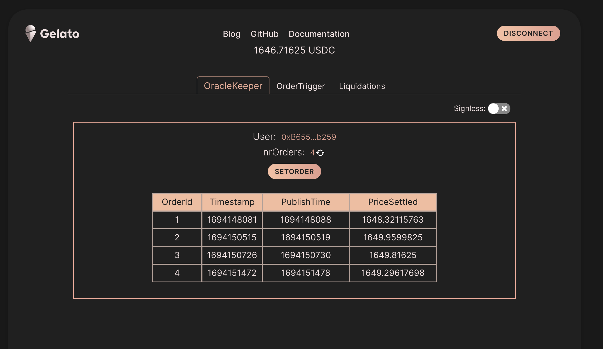
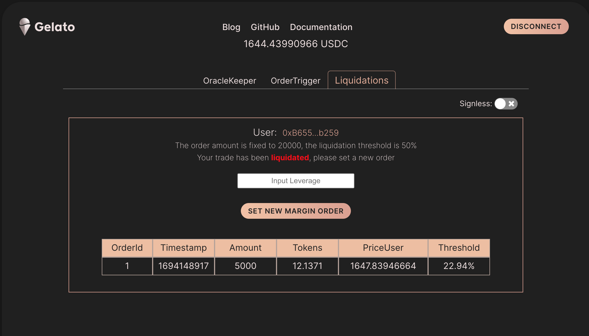

# Gelato ❤️ Perps

At Gelato we love perps because Perps are all about speed and this is precisely our essence 😉. We deliver on-chain the correct data just when you need it.

In this repo, we compile the four core perps processes that we have seen our customers integrating or are about to integrate.

The application is live on Arbitrium Goerlit:  [https://perps-gelato.web.app](https://perps-gelato.web.app) and the Perpetual Mock contract is deployed and verified on [ArbitriumGoerli](https://goerli.arbiscan.io/address/0x0542F269C737bDe9e2d1883FaF0eC2F3D51e5B95)

### What is a perpetual contract?

 A perpetual contract is a derivative that derives its value from the underlying asset. The main difference with the classical futures contracts is that it does not have an expiry date, so the user will need to close the position, or in the case that the price goes against your prediction, you can add collateral.

## Perp Core Processes

- Low Latency Oracle: Order Settlement
- Order Matching: Conditional Orders
- Liquidations
- Signless Trading

## Low Latency Oracle: Order Settlement

One of the fundamental requirements of perpetuals is to have on-chain verifiable data when it is needed. Traditional oracles were pushing prices continuously on-chain, however this solution presents different problems:

- Most of the prices won't be needed, so it is very gas inefficient
- Prices are known in advance of the trade and thus can be front-ran

In this use case, we show how we can mitigate these issues using a combination of new-generation oracles like Pyth and Gelato Web3 Functions.

Please see more details in [Low Latency Oracles Use Case](/docs/oracle.md)

## Order Matching

Conditional orders are a fundamental piece of the perpetuals ecosystem, as is the basis for any trading strategy.

In this use case, we showcase how we can, with the welp of Web3 Functions create a very robust order matching system.

Please see more details in [Conditional Orders](/docs/conditional.md)

## Liquidations

One core process of any perpetual protocol is the liquidation process. Traditionally, the liquidation was run by external members who got rewarded when they ran liquidations on behalf of the protocol. Gelato Web3 Functions allows the protocols to run themselves the liquidations to use the liquidation rewards to incentivize the protocol users.

In this use case, we showcase how we can create an auto-scalable liquidation system with the help of Web3 Functions.

Please see more details in [Liquidations](/docs/liquidations.md)

## Gasless & Signless

This use-case showcases how we can easily implement Gasless transactions, so the users don't need to have native tokens to execute transdactions, and even implements Temporary Session Keys, that allow users to sign the start of the session and then execute trades without the need of signing anymore as long as the Sesson Key is still valid

In this use case, we showcase how we can create aa simple soluton to enable Gasless & Signless trading with Gelato Relay.

Please see more details in [Gasless & signless](/docs/signless.md)

