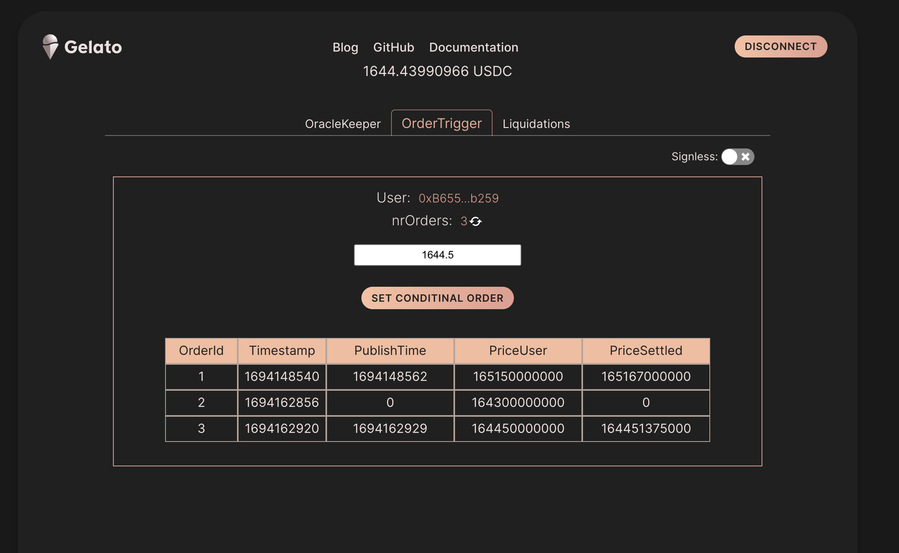

# Gelato ❤️ Perps: Conditional Orders & Order Matching

This use case showcases how we can set conditional orders on-chain, and with the help of Web3 Functions we can match the orders with ooff-chain data and execute them on-chain
The application is live on Arbitrium Goerlit:  [https://perps-gelato.web.app](https://perps-gelato.web.app) and the Perpetual Mock contract is deployed and verified on 

### Results:

The PerpMock contract is deployed and verified on [ArbitriumGoerli](https://goerli.arbiscan.io/address/0x0542F269C737bDe9e2d1883FaF0eC2F3D51e5B95)
and the Web3 Function can be found [here](https://beta.app.gelato.network/task/0xdbe97fb8c2a1e0246176b72323dc44b03210c5f5ff696c63eecdf4f61db7e8ea?chainId=421613)

As we can see in the results, order 2 has yet to be executed as, in this case, the price has yet to go down to the price settled by the user.

### Why Gelato Web3 Functions?

The three benefits of using Gelato Web3 functions are: 

1) Low Latency to 5-sec runs
2) Handling different types of conditional Orders within the one web3 function
3) In Web3 Function storage of not yet executed conditional orders 

### Three simple steps and voilà:

1) Prepare your contract by including an event when the order is set and create a function with the modifier only allowing Gelato Web3 Functions to go through

 See contract [PerpMock.sol](../contracts/PerpMock.sol#L132)

 

2) Create a Web3 Function that queries the events emitted by the contract, adds the stored conditional orders, and do the order-matching

 See code [here](../web3-functions/trigger-order/index.ts#L71)

 

3) If the orders match, prepare the data to be published on-chain

 See code [here](../web3-functions/trigger-order/index.ts#L128)

 

4) Voilà: the [Web3 Function](https://beta.app.gelato.network/task/0xdbe97fb8c2a1e0246176b72323dc44b03210c5f5ff696c63eecdf4f61db7e8ea?chainId=421613) executes and settle the price

 

