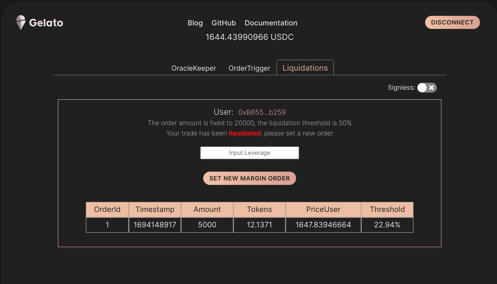
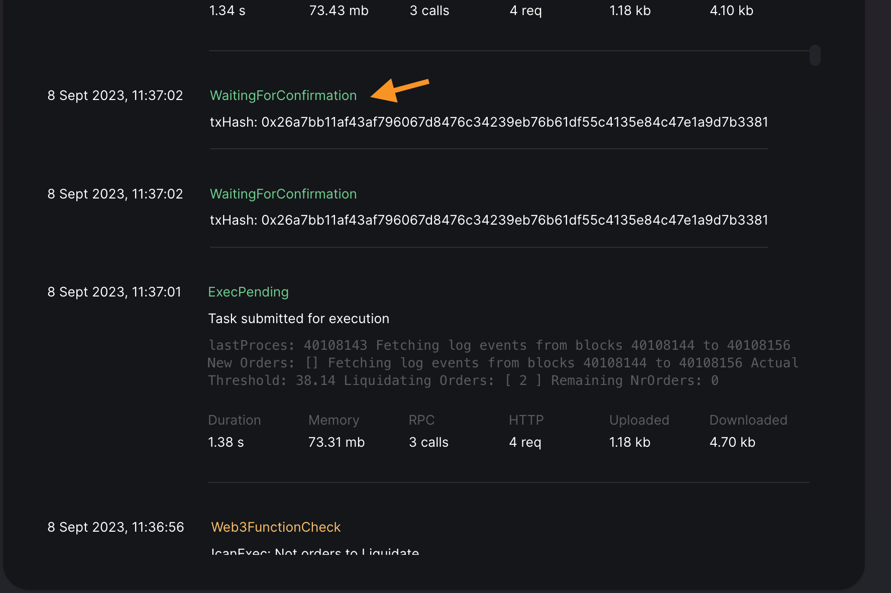

# Gelato ❤️ Perps: Liquidations

This use case showcases how we can set up a scalable liquidation system with the help of Gelato Web3 Functions that could provide protocols with the first option to liquidate or a back-stop solution if other methods fail.

The Collateral threshold is 50%, so if the price goes against the trade or collateral is removed, and the threshold goes below 50%, the trade will be liquidated

The application is live on Arbitrium Goerlit:  [https://perps-gelato.web.app](https://perps-gelato.web.app) and the Perpetual Mock contract is deployed and verified on 

### Results:

The PerpMock contract is deployed and verified on [ArbitriumGoerli](https://goerli.arbiscan.io/address/0x0542F269C737bDe9e2d1883FaF0eC2F3D51e5B95)
and the Web3 Function can be found [here](https://beta.app.gelato.network/task/0xed06b3b19d6cba11dfa86335c64cae6597833c0975f09fe9725b7cfcfe4af688?chainId=421613)

As we can see in the results, the order shown was liquidated because the collateral went to 28%.

Once created an order we can update the collateral.

 

### Why Gelato Web3 Functions?

The three benefits of using Gelato Web3 functions are: 

1) Low Latency to 5-sec runs
2) Possibility to fetch on-chain and off-chain data to run the liquidation logic
3) In Web3 Function storage with the ability to scale spawning automatically other Web3 Functions if the protocol 🚀

### Three simple steps and voilà:

1) Prepare your contract by including an event when the order is set and create a function with the modifier only allowing Gelato Web3 Functions to go through

 See contract [PerpMock.sol](../contracts/PerpMock.sol#L189)

 

2) Create a Web3 Function that queries the events emitted by the contract, creating a trade or updating the collateral of an existing trade, adds the stored orders, and calculates the thresholds. 

 See code [here](../web3-functions/liquidations/index.ts#L86)

 

3) If the current threshold of a trade goes below 50%, it will be included in the liquidations array and pushed on-chain

 See code [here](../web3-functions/liquidations/index.ts#L168)

 

4) Voilà: the [Web3 Function](https://beta.app.gelato.network/task/0xed06b3b19d6cba11dfa86335c64cae6597833c0975f09fe9725b7cfcfe4af688?chainId=421613) executes and settle the price

 

