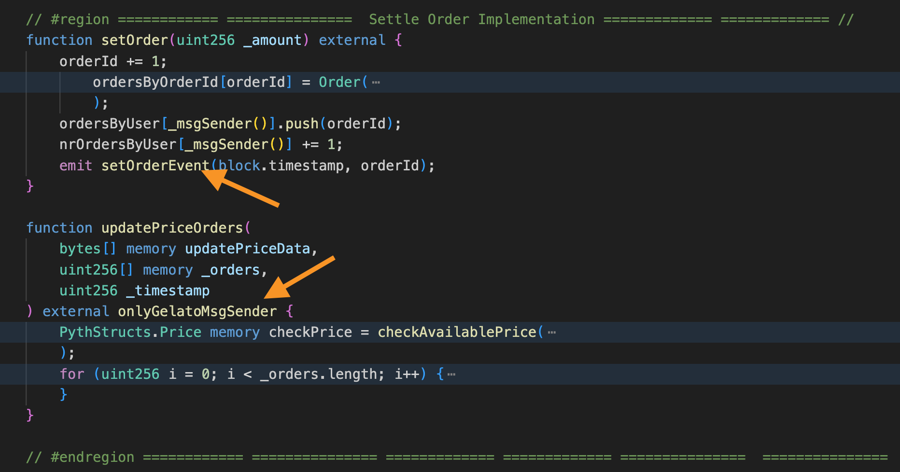
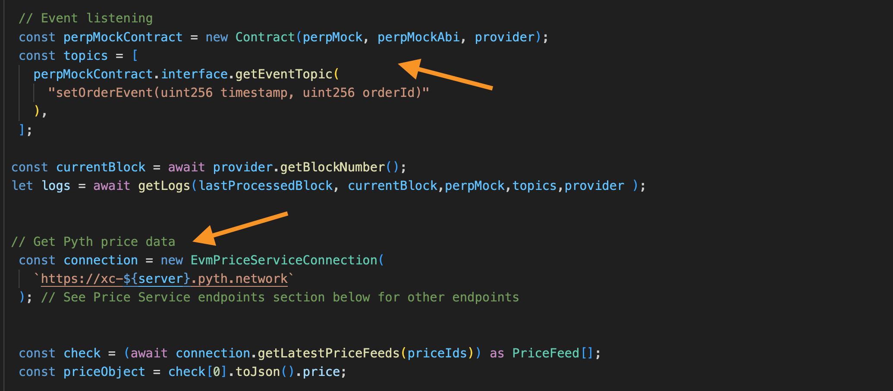
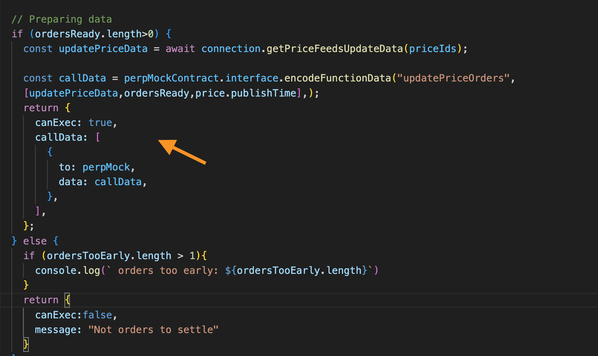
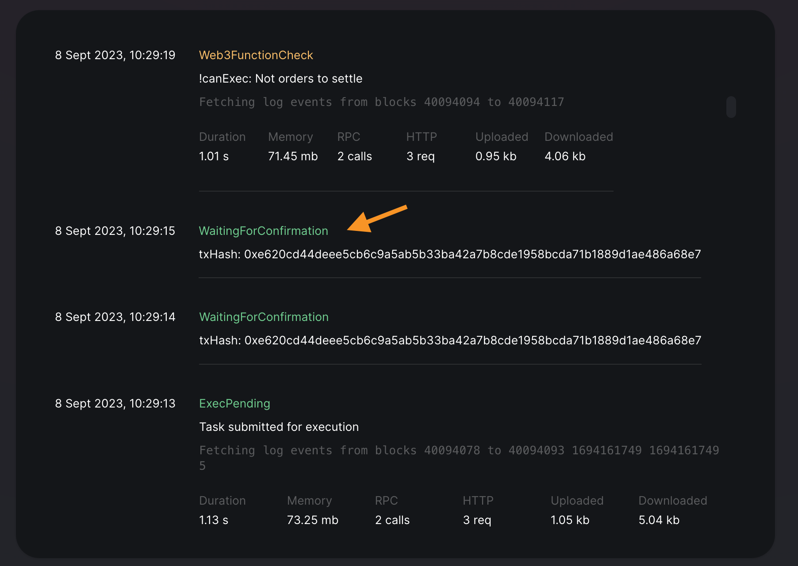

# Gelato ❤️ Perps: Low Latency Oracle Use-Case

This use-case showcases how we can set Orders on-chain and, with the help of Gelato Web3 Functions query the price off-chain and publish the price on-chain.
Per spec, the requirement is to delay 4 sec the price so it ensures no frontrunning is possible.

### Results:

The PerpMock contract is deployed and veryfied on [ArbitriumGoerli](https://goerli.arbiscan.io/address/0x0542F269C737bDe9e2d1883FaF0eC2F3D51e5B95) and the Web3Function can be found [here](https://beta.app.gelato.network/task/0xadfdf247ae7e56f120fed8a105722ca6042668bb3d0fd7ef988a7bc9f5d59e1c?chainId=421613)

As we can see in the result, the price was settled in (7,4,4,4) seconds.

### Why Gelato Web3 Functions?

The three benefits of using Gelato Web3 functions are: 

1) Low Latency to 5-sec runs
2) Possibility to use any Oracle provider importing the SDK
3) Payment of Oracle fees possible through a proxy contract

### Three simple steps and voilà:

1) Prepare your contract by including an event when the order is set and create a function with the modifier only allowing Gelato Web3 Functions to go through

 See contract [PerpMock.sol](../contracts/PerpMock.sol#L93)

 

2) Create a Web3 Function that queries the events emitted by the contract and queries the current price

 See code [here](../web3-functions/oracle-keeper/index.ts#L39)

 

3) If the conditions are met, in this case, a delay minimum of 4, the Web3 function will prepare the transaction to be published on-chain

 See code [here](../web3-functions/oracle-keeper/index.ts#L99)

 

4) Voilà the [Web3 Function](https://beta.app.gelato.network/task/0xadfdf247ae7e56f120fed8a105722ca6042668bb3d0fd7ef988a7bc9f5d59e1c?chainId=421613) executes and settle the price

 

