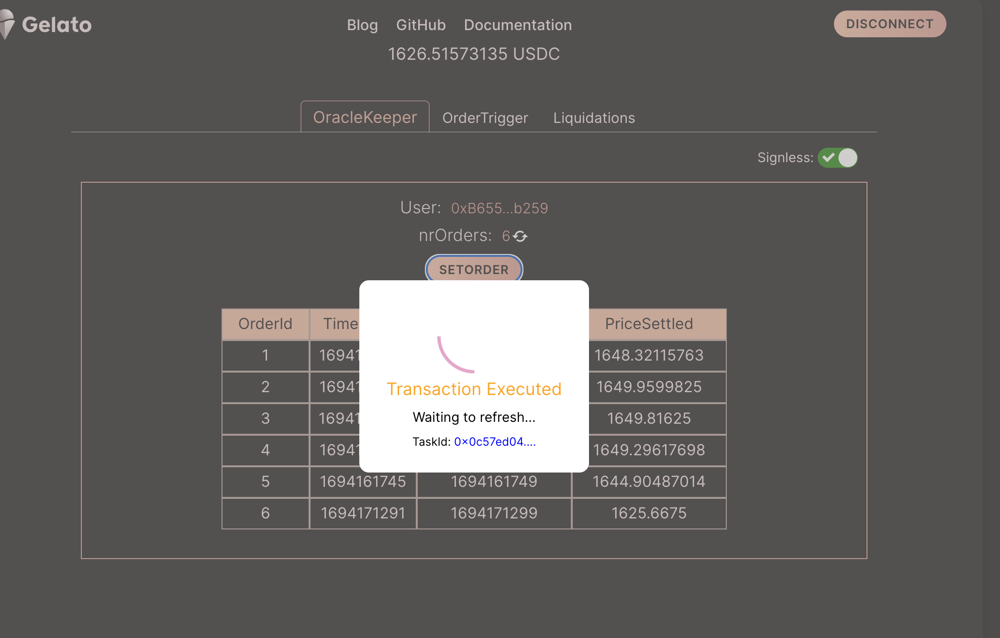
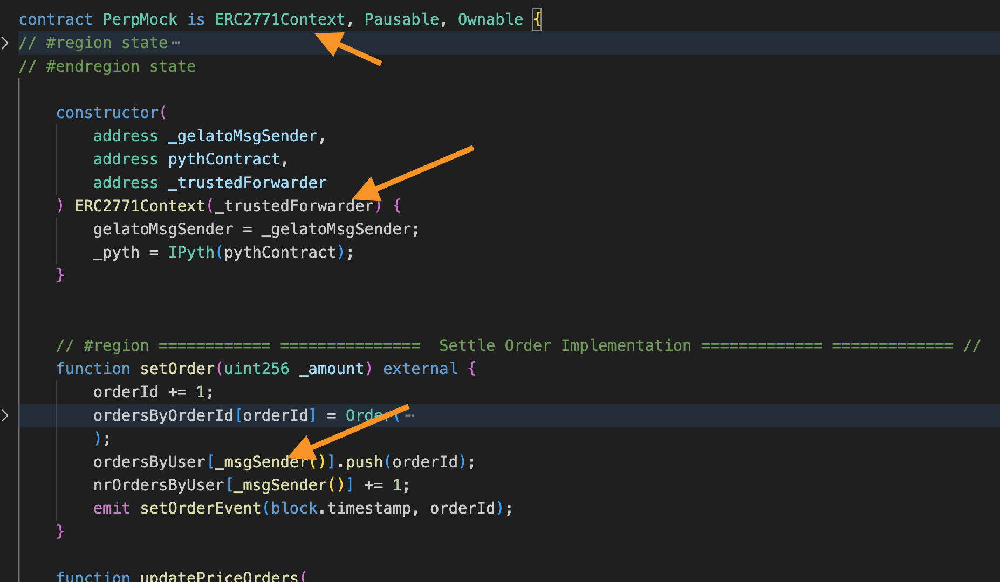
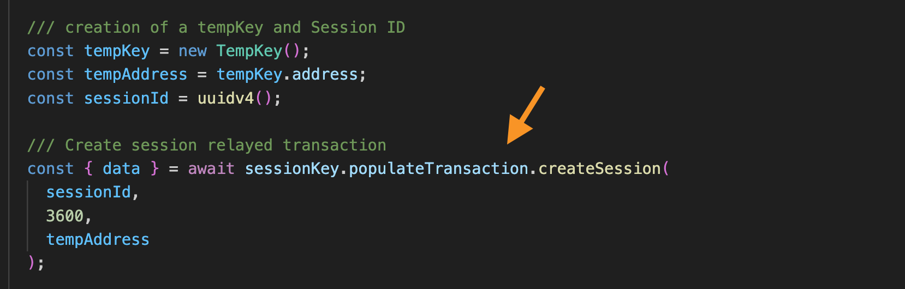
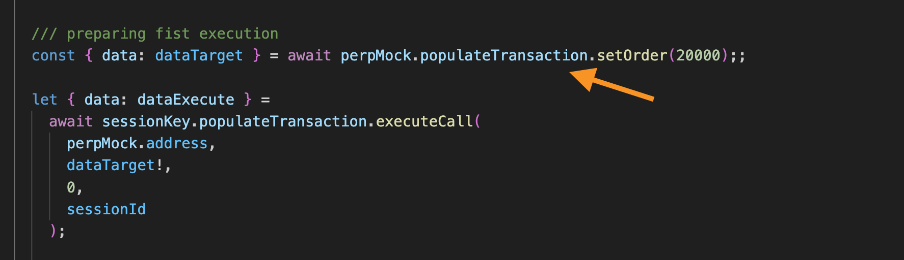

# Gelato ❤️ Perps: Gasless & Signless

This use-case showcases how we can easily implement Gasless transactions, so the users don't need to have native tokens to execute transdactions, and even implements Temporary Session Keys, that allow users to sign the start of the session and then execute trades without the need of signing anymore as long as the Sesson Key is still valid

The application is live on Arbitrium Goerlit:  [https://perps-gelato.web.app](https://perps-gelato.web.app).

### Results:

The SessionKeys Contract is deployed on [ArbitriumGoerli](https://goerli.arbiscan.io/address/0x5B91C8E7a2DEABC623E6Ab34E8c26F27Cc18bC66)

The PerpMock contract is deployed and verified on [ArbitriumGoerli](https://goerli.arbiscan.io/address/0x0542F269C737bDe9e2d1883FaF0eC2F3D51e5B95) and the Web3Function can be found [here](https://beta.app.gelato.network/task/0xadfdf247ae7e56f120fed8a105722ca6042668bb3d0fd7ef988a7bc9f5d59e1c?chainId=421613)



When clicking the switcher **Signless** the dapp will:
- Check if there are already sessionkeys available in the browser
- Check if these keys are still vaild
- Create new session keysif needed
- Use session keys to sign following transactions 

Once signless is activated, the transactions will be relayed to the SessionKeyContract and forwarded to the target contract, in our case the Perpmock contract

### Why Gelato Web3 Relayer?

The main three benefits of using Gelato Relayer fro Signless are : 

1) High Performance, Scalability
2) Offering best in Class UX
3) Improve Onboarding 


### Three simple steps and voilà:

1) Implementation of ERC2771 in the PerpMock contract, inheriting the ERC2771 Context contract, instantiating it in the constructor and changing `msg.sender` through `_msgSender()` 

    See contract [PerpMock.sol](../contracts/PerpMock.sol#L17)

    


2) Create a session in the browser signing a first transaction

    See code [here](../test/session-keys/SessionKeys.test.ts#L46)

    


3) Execute the transactions instantiating a wallet with the temprary Session Key and relay the transaction

    See code [here](../test/session-keys/SessionKeys.test.ts#L77)

     

4) Voilà the transaction happened gasllessly and signlessly
    ``````
    {
    "task":{"chainId":421613,
    "taskId":"0x73c05d424833fe7c72a3f63b54ae55574f629d2ea2611901b2615f153a6fd204",
    "taskState":"ExecSuccess"
    ,"creationDate":"2023-09-08T11:19:08.405Z",
    "executionDate":"2023-09-08T11:19:21.822Z",
    "transactionHash":"0xc5f2cc1f3d025bdb9d7ee058e60b351861bea5e3d9ddfb1a6c856847e39a431e",
    "blockNumber":40129420 }
    }
    ``````


